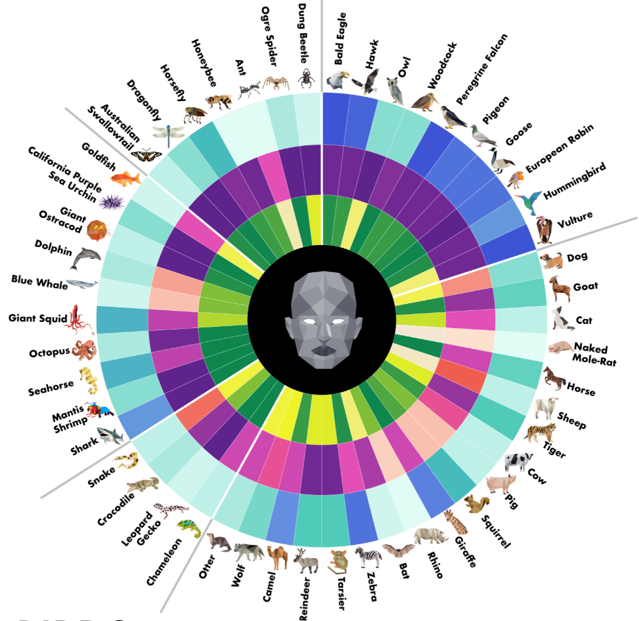
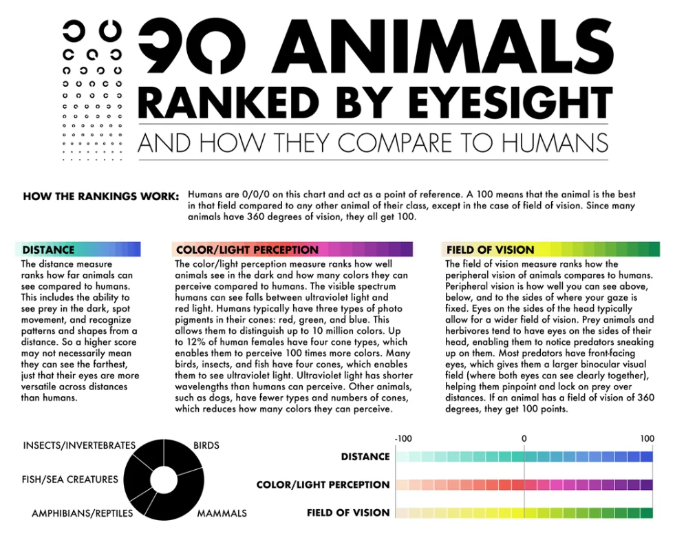
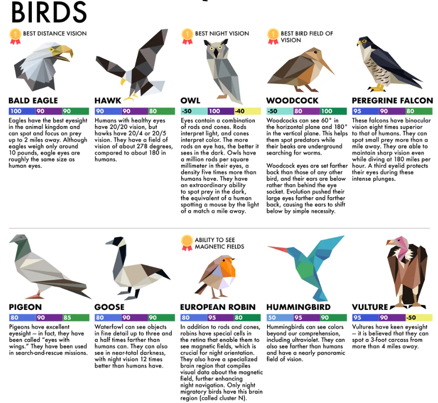
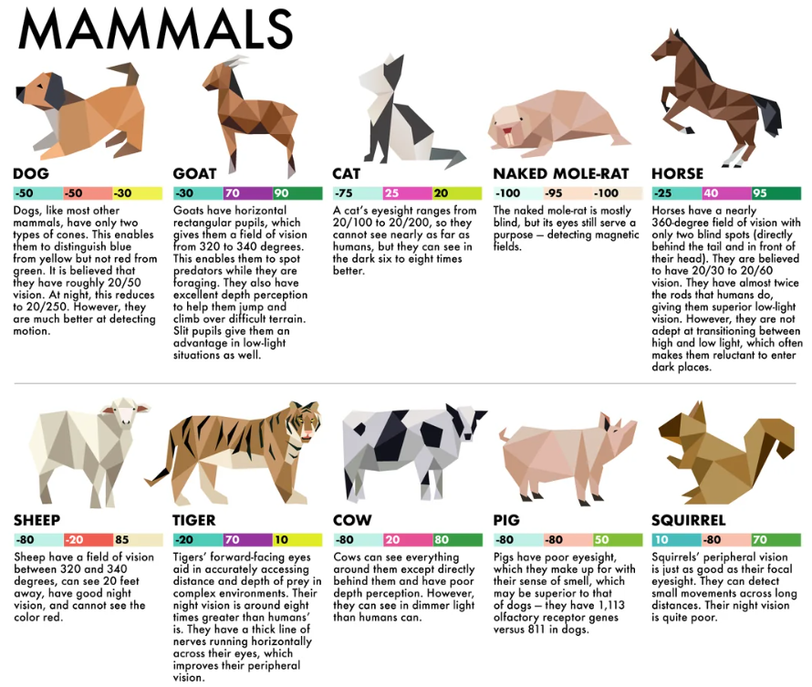
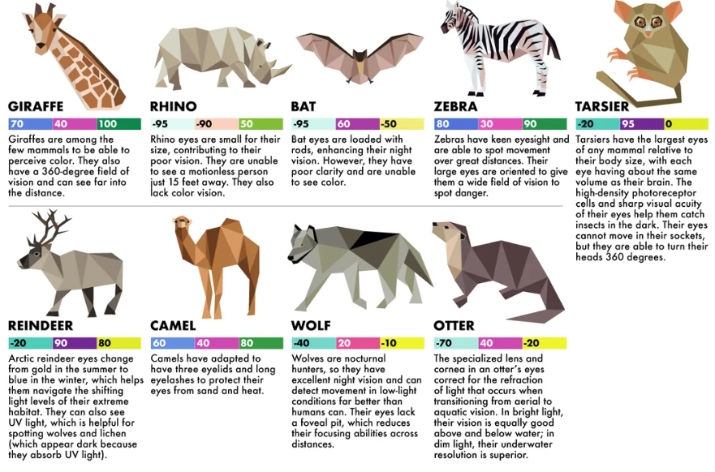
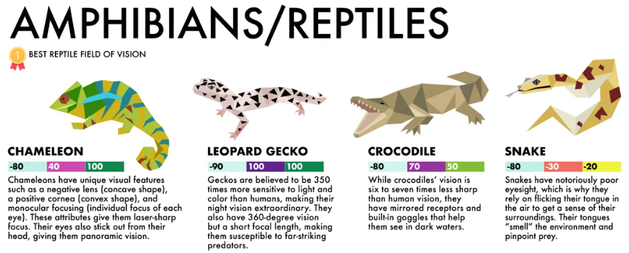
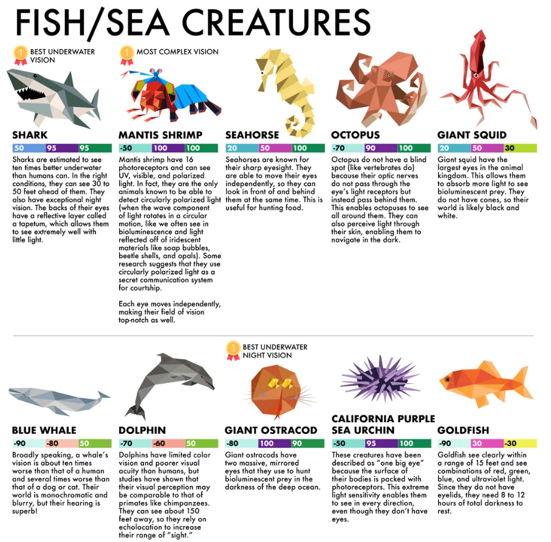
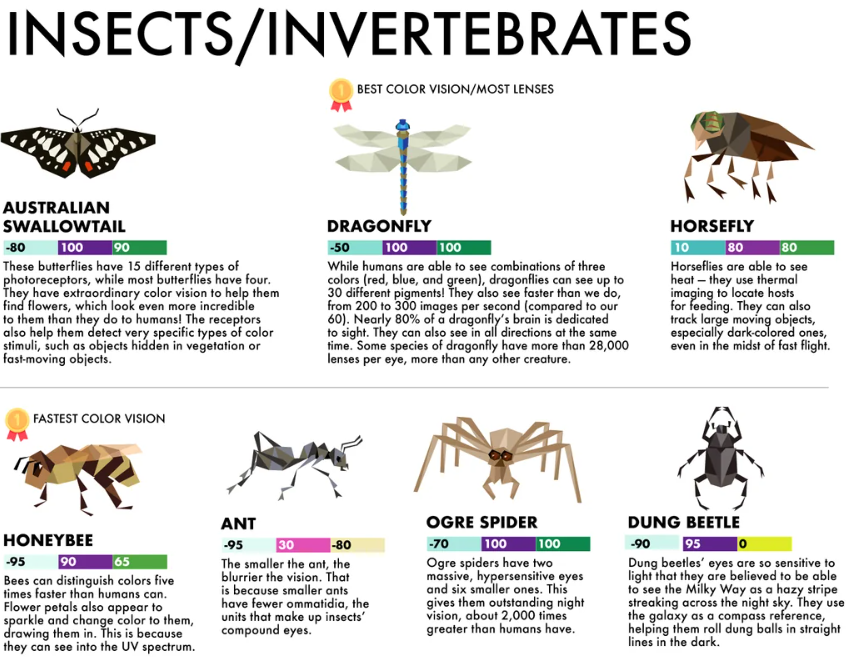
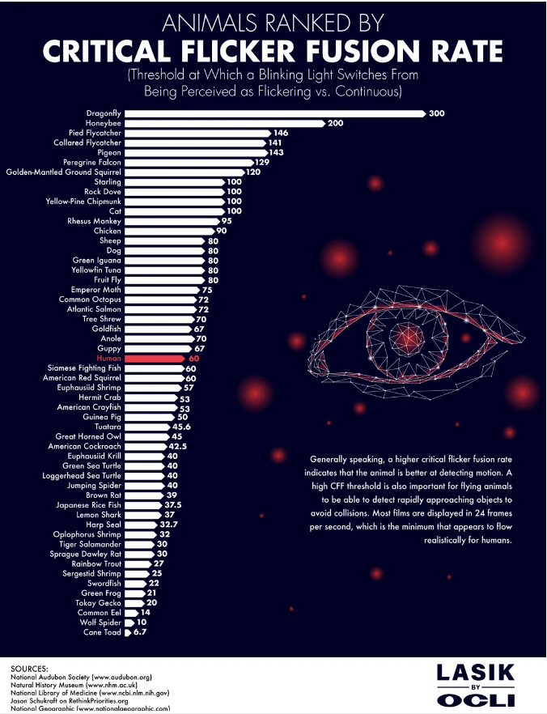

# Animal Vision Benchmark

(Source: [Link](https://www.reddit.com/r/NatureIsFuckingLit/comments/gquufn/most_impressive_eyes_from_the_animal_kingdom/#lightbox))

## Overview

This is a curated collection exploring the wonders of animal vision and perception, revealing how these creatures perceive the world differently from us.

## 90 Animals Ranked by Eyesigh

### Benchmarking 

### BIRDS

### MAMMALS

### AMPHIBIANS / REPTILES

### FISH / SEA CREATURES

### INSECTS / INVERTEBRATES

## Ranked by Critical Flicker Fusion Rate (CFFR)

## References
- Official source - www.lasikbyoclivision.com: https://www.lasikbyoclivision.com/90-animals-ranked-by-eyesight/
- Reddit chart: https://www.reddit.com/r/Infographics/comments/16g7h99/90_animals_ranked_by_eyesight_and_how_they/?rdt=61436
- [32 Facts About Animal Eyes - discoveryeye.org](https://discoveryeye.org/32-facts-about-animal-eyes/)

Wikipedia: 

- [Flicker fusion threshold](https://en.wikipedia.org/wiki/Flicker_fusion_threshold)
- [Vision Science](https://en.wikipedia.org/wiki/Vision_science)
- [Category:Vision scientists](https://en.wikipedia.org/wiki/Category:Vision_scientists)

Books:

- [Animal Eyes: How Creatures See and How Their Eyes Have Adapted to Their World - Francoise Vulpe](https://www.amazon.fr/Animal-Eyes-Creatures-Their-Adapted/dp/0228104130)
  
Vision Science Research:

- [Gerald Westheimer, OD, PhD, FAAO](https://optometry.berkeley.edu/people/gerald-westheimer-od-phd-faao/)
- [Berkeley Vision Science](https://vision.berkeley.edu)
- [MIT CSAIL - Vision Group](https://www.csail.mit.edu/research/vision-group)
- [Stanford - Vision Science](https://psychology.stanford.edu/research/vision-science)
- [Harvard - Vision Lab](https://visionlab.harvard.edu/)
- [Cambridge - Vision](https://www.cam.ac.uk/topics/vision)
  - Lab:
    - https://vision.psychol.cam.ac.uk/
    - https://cambridgebrc.nihr.ac.uk/expandables/cambridge-clinical-vision-laboratory-ccvl/
    - https://www.bohndieklab.org/
- [Oxford - Vision Science](https://www.psy.ox.ac.uk/research/perception-lab/ox/oxvis)
  - [ERGO - Eye Research Group  Oxford](https://eyeresearchoxford.org.uk/)    

